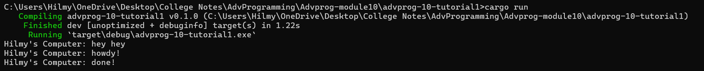
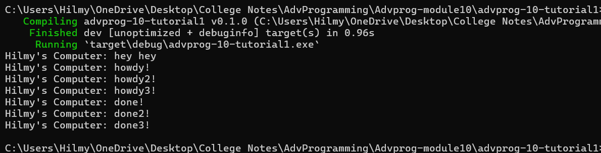
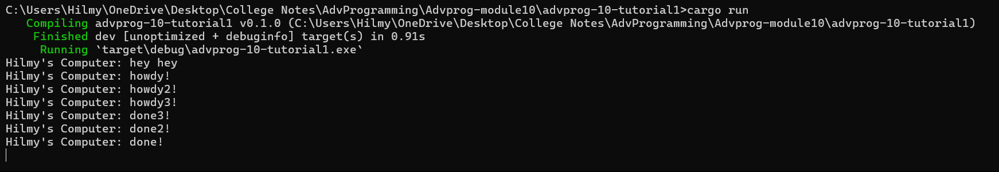
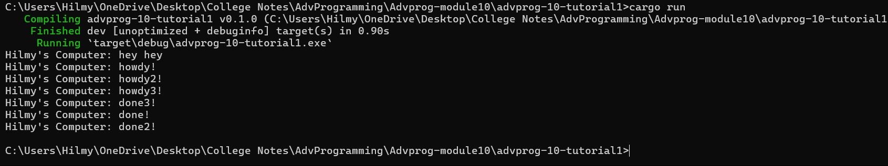

## Explanation 1.2. Understanding how it works.

+ `Hilmy's Computer: hey hey` - This is immediately printed from main after spawning the task but before the executor starts processing tasks.
+ During task execution, the executor begins working through its list of tasks. 
+ One of these tasks prints `Hilmy's Computer: howdy!` when it starts executing. Additionally, there's a task waiting for a TimerFuture to finish. Inside its loop, the executor checks tasks by polling their futures to determine if they're complete. Initially, the status of the timer future is Pending because it's set to complete after a 2-second delay. 
+ Meanwhile, a separate thread created by TimerFuture::new(Duration::new(2, 0)) is sleeping. After 2 seconds, this thread wakes up and marks the task as complete by setting shared_state.completed = true and waking up the task. When the executor polls the task again, it finds that it's now Ready, indicating it's finished. With no more tasks left to do, the executor completes its work. This process illustrates how tasks can wait for events to finish asynchronously.
+ `Hilmy's Computer: done!` - This is printed by the spawned task when the TimerFuture completes after 2 second

## Experiment 1.3: Multiple Spawn and removing drop
### Multiple Spawner Result

+ **With `drop(spawner)`**: When you drop the spawner, it signals to the executor that no more tasks will be spawned, and the executor runs the tasks already queued. This results in the tasks such as Hilmy's Computer: howdy! 1 to 3 executing and waiting for their respective TimerFuture to complete ( Hilmy's Computer: done!, done2!, done3!). Once all tasks are completed, the executor finishes its work, and the program exits.
### Remove Drop Spawner Result

+ **Without `drop(spawner)`**: Without dropping the spawner, the executor continues to wait for more tasks to be spawned because the spawner is still active. This prevents the executor from finishing even after all currently spawned tasks are completed (Hilmy's Computer: done3!, done2!, done!).
### Putting Back Spawner Result

+ **After putting back `drop(spawner)`**: Once you put back drop(spawner), it follows the same behavior as the first case. The executor runs all queued tasks (Hilmy's Computer: howdy!, howdy2!, howdy3!) and waits for their completion (Hilmy's Computer: done!, done2!, done3!). Afterward, it finishes its work and the program exits.